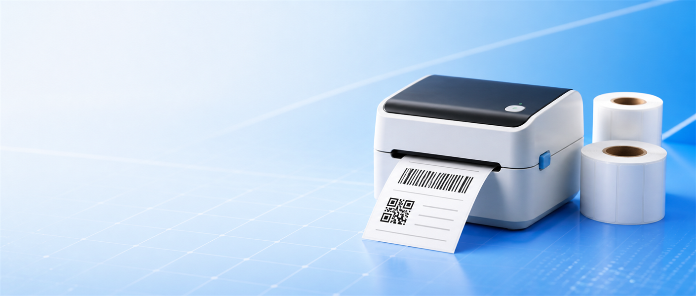
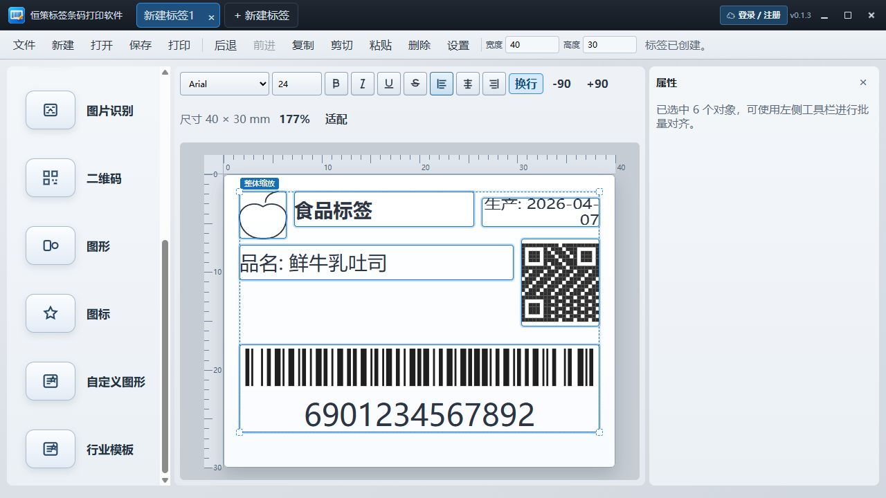
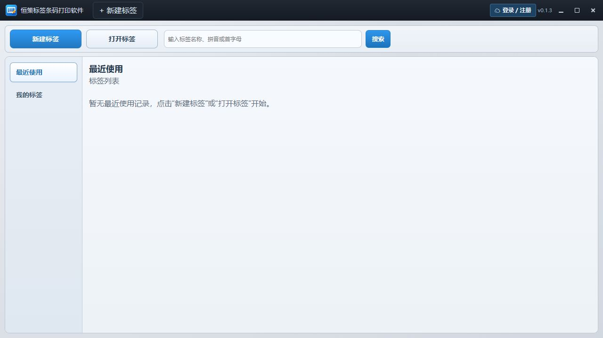

# 做标签，不必在表格和打印窗口之间来回切换

> 恒策标签条码打印软件 · 当前产品能力介绍

门店价签、商品标签、物流条码、食品信息贴……真正耗时间的，往往不是打印那一下，而是反复调整尺寸、复制内容、替换数据，再逐张确认。

恒策标签条码打印软件希望把这些步骤收进一个 Windows 桌面工作台：从标签设计、数据绑定，到打印或 PDF 输出，尽量在同一个流程里完成。

本文依据 2026 年 8 月 18 日当前开发版整理。

## 先从一张标签开始

软件以标签尺寸为起点。新建时可以直接选择常用规格，也可以手动输入宽高；进入编辑器后，再把文字、日期时间、条码、二维码、图片、图形和图标放到画布中。

### 常见场景不必每次从零排版

当前编辑器内置食品、服装、物流和零售等行业模板。选择模板后仍可继续修改文字、尺寸、位置和样式，既保留快捷起点，也不会把版式锁死。

*实机开发界面：40×30 mm 食品标签模板，包含文字、二维码和条码元素。*

## 把可变数据交给批量流程

### CSV、Excel 数据可以绑定到标签字段

商品名、SKU、批次、价格等内容不需要一张张手改。导入 CSV 或 Excel 后，可以把列绑定到标签元素，再按每一行数据生成不同的打印内容。

### 每条记录都按自己的数据输出

当前实现会逐条渲染可变数据，并输出到 Windows 打印机或多页 PDF。例如 3 条数据、每条 2 份，对应 6 张标签，而不是把第一条重复打印 6 次。

## 编辑、保存和查找放在同一个入口

标签可以保存为本地文件；登录后，也可以按分类保存到个人云空间。当前代码已包含最近使用、搜索、云标签、回收站、离线缓存、自动重试和同步冲突处理等入口。本地文件不会在未操作的情况下自动上传。

*实机开发界面：首页集中提供新建、打开、搜索、最近使用和个人标签入口。*

## 它适合哪些日常工作

### 门店与零售

制作商品价签、促销标签、货架标签，批量替换商品名、价格和条码。

### 食品与生产

整理品名、生产日期、批次和追溯信息；正式使用前仍应按业务要求核对标签内容。

### 仓储与物流

通过表格数据生成不同 SKU、库位或包裹标签，并按记录顺序打印。

### 服装、样品与资产管理

组合款号、尺码、二维码、条码和说明文字，保存为可重复使用的模板。

## 当前状态，也需要坦诚说明

项目文档目前将第一版标记为“代码功能已完成，等待生产环境与真机验收”。正式对外安装包仍需要完成签名、干净 Windows 10/11 x64 安装升级、真实热敏打印机、常用标签尺寸和条码扫描验证。

因此，本文介绍的是当前产品能力，不把尚未完成的验收写成已经发布的承诺。

软件面向 Windows x64 桌面环境，当前打印后端依赖系统驱动，暂未提供 ZPL、TSPL 等原生指令后端。项目同时保留 Windows 7 x64 兼容构建流程；发布时会把 Windows 10/11 安装版和 Windows 7 兼容版分开列出，请按自己的系统选择。实际打印效果仍会受到打印机驱动、纸张、碳带、分辨率和校准设置影响。

## 下载与安装

- 下载渠道：夸克网盘（发布前上传）
- 下载地址：发布前填写

Windows 10/11 x64 安装版：

- 文件名：发布前确认正式安装包文件名
- SHA-256：发布前计算并填写

Windows 7 x64 兼容版：

- 文件名：发布前确认 Win7 安装包文件名
- SHA-256：发布前计算并填写

本文下载链接如使用推广网盘，可能产生推广收益，不影响你的免费下载。

如果你经常制作商品标签、物流条码或批量可变数据标签，可以先保存本文；正式安装包完成验收后，再通过文末链接下载体验。

---

发布前请删除本提示，并确认下载地址、文件名、系统支持范围和 SHA-256 均与实际安装包一致。
